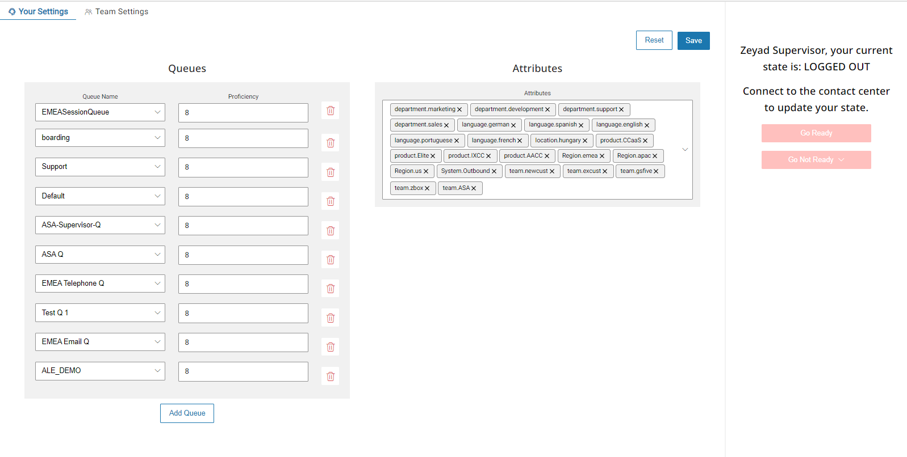

# Queues and Attributes Admin Widget

## Description

This custom widget empowers Agents and Supervisors with the ability to:
- Change their active state between `Go Ready` and `Go Not Ready`, specifying a `reason code`.
- Update their matching configuration, including `Queues` and `Attributes`.
  - Available for _BOTH_ `Agents and Supervisors`.
- Update their team's matching configuration (for Supervisors only), modifying `Queues` and `Attributes`.

## :warning: **Disclaimer**

> :bulb: This sample application is provided **for demonstration purposes only** and is not intended for production use. We assume no responsibility for any issues arising from its use.

---

## Technical Details

The widget primarily uses the `AXP Public Admin APIs` and the `Workspaces Widget Framework SDK`.

### Workspaces Widget Framework SDK
- `onDataEvent("onAgentStateEvent", callback)`: Subscribe to changes in Agent's state.
- `getConfiguration().user`: Retrieve the full logged-in Agent configuration.
- `getCapabilities()`: Determine Agent capabilities for Ready/Not Ready states.
- `getNotReadyReasonCodes()`: Fetch Not Ready Reason Codes for the agent.
- `setAgentReady()`: Triggered when the agent goes Ready.
- `setAgentNotReady(reasonCode)`: Triggered when the agent goes Not Ready, with a reason code.
- `getTeamData()`: Fetch Supervisor's Team details.

### Admin APIs
- [Authorization](https://developers.avayacloud.com/onecloud-ccaas/docs/how-to-authenticate-with-ccaas-apis#client-credentials-grant): Acquire an access token for API calls.
- [Get User](https://developers.avayacloud.com/onecloud-ccaas/reference/getuser): Retrieve Agent details including matching features.
- [Update User](https://developers.avayacloud.com/onecloud-ccaas/reference/updateuser): Apply changes to the agent's queues and attributes.
- [List Categories](https://developers.avayacloud.com/onecloud-ccaas/reference/listcategories): Retrieve Categories/Attributes for the tenant.
- [List Queues](https://developers.avayacloud.com/onecloud-ccaas/reference/listqueues): Get configured Queues for the tenant.

## Configuration & Installation

The widget consists of the `bundle.js` file and a backend component for authorization and Admin API requests proxying. Both components are not multi-tenanted and require individual deployment per tenant.

Pre-requisites include AXP Client Credentials `(CLIENT_ID and CLIENT_SECRET)` and AXP API Application Key `(AXP_API_APP_KEY)`. Node.js `v18.0+` is also necessary.

### Running the Backend Component
Refer to the AXP Proxy API build & deploy guide available [here](https://github.com/AvayaExperiencePlatform/axp-api-proxy).

### Building the Widget bundle.js File
The bundle.js file is built out of the react-app `(agent-matching-config-widget)`


To build the `bundle.js` file:
- Navigate to `src/app/config.js` and update the configuration for your tenant:
```js
export default {
    env: {
        AXP_CLIENT_ID: "YOUR_AXP_CLIENT_ID",
        AXP_PROXY_BASE_URL: "https://your_server_fqdn_running_axp-proxy-api:3001",
        AXP_ACCOUNT_ID: "ABCDEF",
        AXP_API_APP_KEY: "your-secret-api-app-key"
    },
};
```
- Run `yarn install` to install dependencies.
- Run `npm run prod` to build the bundle.js file, it will be in the build/ folder.


## Dockerized Hosting

### Prerequisites
- Node.js version 18+.
- Docker & Docker Compose.
- SSL Certificate & Key.
- Upload `agent-matching-config-widget.json` to Avaya Experience Platform Admin Portal -> Widget Management.

### Steps
1. Update `docker-compose-dev.yml` with SSL certificate paths.
2. Build and deploy the widget:
   ```sh
   yarn install
   npm run build
   docker-compose -f docker-compose-dev.yml up # add -d for background process
   ```
3. To apply changes, run `npm run build` and refresh workspaces.

If you've done everything correctly, it should look something like this (default without any changes).



## Manual Hosting

### Hosting with NGINX
Serve the widget using any web server. Here is an NGINX configuration example:

```nginx
server {
    listen 8443 ssl;
    ssl_certificate /etc/nginx/cer.cer;
    ssl_certificate_key /etc/nginx/key.key;
    add_header Access-Control-Allow-Origin *;
    root /home/username/Projects/agent-matching-config-widget/build; # Path to bundle.js file
    autoindex on;
}
```
